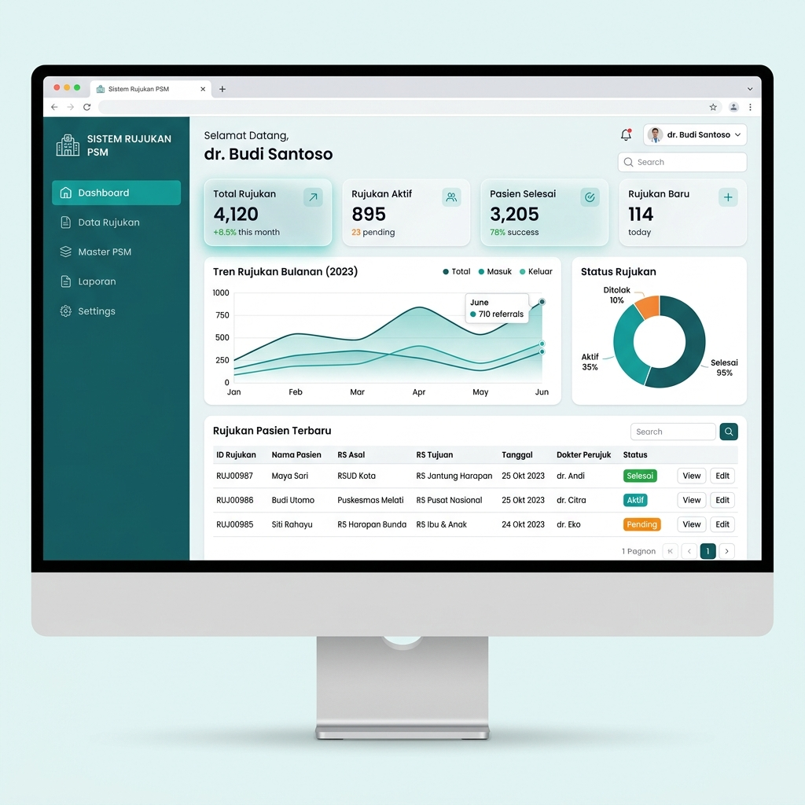

# Sistem Pelaksanaan Rujukan PSM

Sistem informasi ini dirancang untuk mengelola dan memonitor data rujukan pasien yang melibatkan Pekerja Sosial Masyarakat (PSM). Sistem ini membantu rumah sakit atau fasilitas kesehatan dalam melacak data rujukan, menghitung *fee* / insentif PSM, dan mengelola pelaporan secara terintegrasi.

## Fitur Utama
- **Dashboard Interaktif**: Menampilkan statistik informatif mengenai jumlah rujukan dan sebaran data master PSM.
- **Manajemen Data Rujukan**: Pencatatan data pasien rujukan, persetujuan (approve) *fee*, dan status rujukan.
- **Master PSM**: Manajemen lengkap data anggota PSM beserta area cakupan.
- **Kamera & Upload Foto**: Fitur dokumentasi dan verifikasi pendukung berupa foto rujukan secara langsung.
- **Laporan & Rekapitulasi**: Ekspor laporan harian, bulanan, dan rekapitulasi pembayaran (Excel/Cetak).
- **Log Aktivitas**: Pemantauan jejak pengguna (*audit trail*) lengkap dengan informasi *IP Address*.

## Prototype Sistem (UI/UX Mockup)
Berikut adalah gambaran purwarupa / antarmuka visual (prototype) dari Sistem Pelaksanaan Rujukan PSM:

## Teknologi yang Digunakan
- **Backend**: PHP (Native/Procedural)
- **Database**: MySQL / MariaDB (SIMKES Khanza Integration)
- **Frontend**: HTML5, CSS (Tailwind/Bootstrap), JavaScript, jQuery
- **Keamanan**: Enkripsi Password (Bcrypt), Anti CSRF Token, dan MySQLi Prepared Statements.
